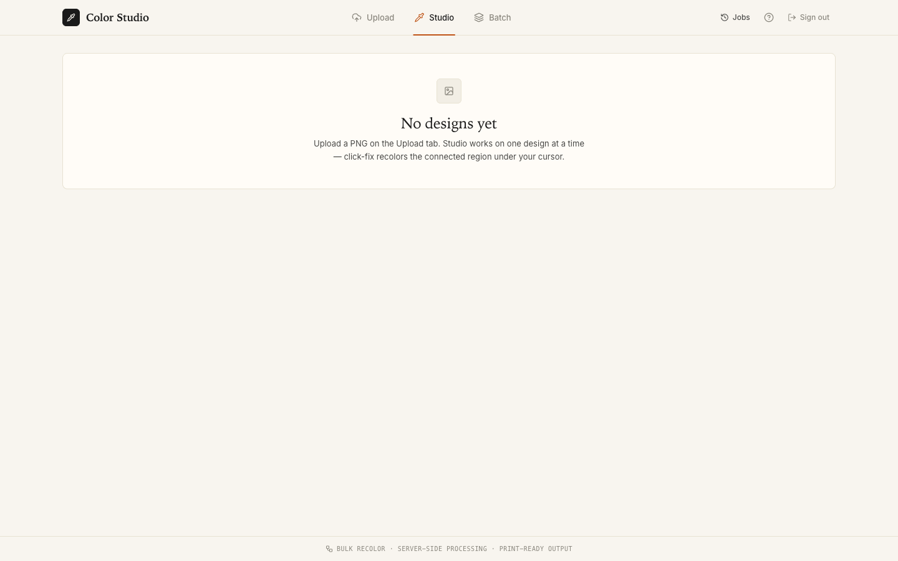
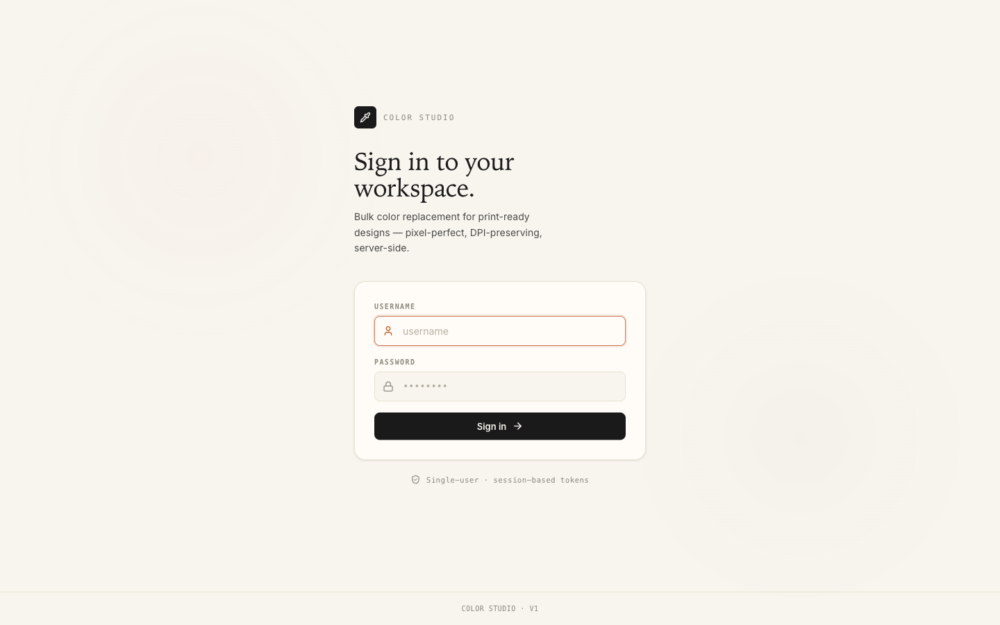
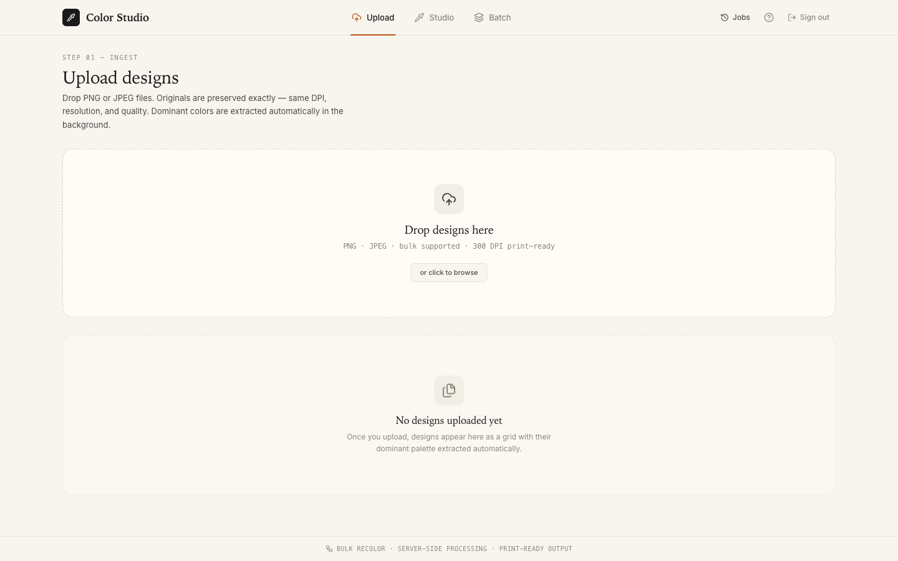
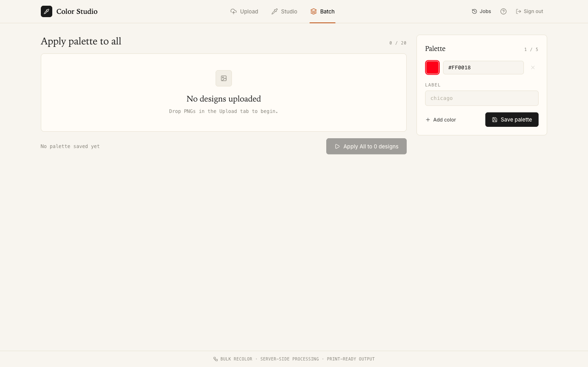
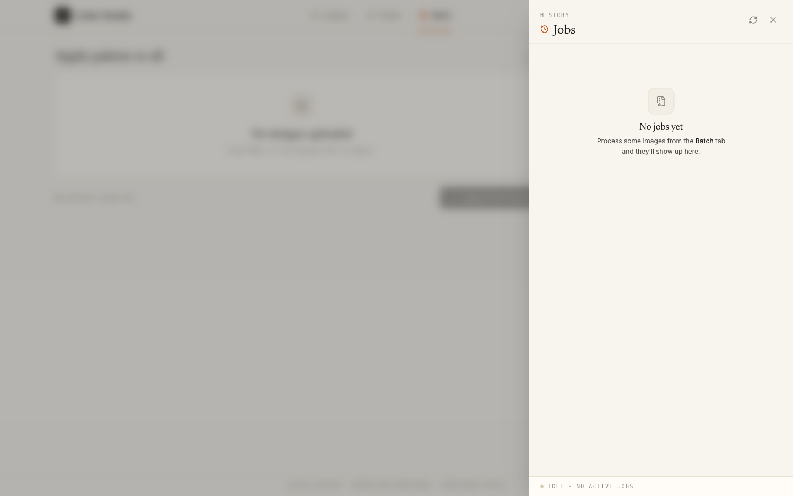

# Bulk Recolor — Color Studio

[](https://www.python.org/)
[](https://react.dev/)
[](LICENSE)

**Pixel-perfect bulk recoloring of PNG and JPEG designs for apparel, sneaker, and POD brands.**

Production tool for batch color replacement on print-ready designs. Upload, define a palette, recolor up to 20 designs in one shot. Pixel-by-pixel preservation: same DPI, same resolution, same quality. Per-region click-fix when an algorithm misses an edge.



---

## At a glance

```
~140  backend tests          unit + integration + acceptance
6     frontend test files    Vitest, mirrors src/ structure
3     algorithms shipped     flood fill, edge-aware, LAB K-means
<60s  end-to-end batch       20 designs on a 2 GB VPS
<200ms click-fix latency     single connected region
≥2 GB RAM recommended        peak under 1.5 GB during a 20-design batch
0     pixel quality loss     originals preserved exactly, DPI untouched
```

---

## What it solves

Three failure modes that the typical Photoshop bucket-fill workflow leaves on the table — every one of them is what this tool was built to fix.

| Failure mode | Symptom | Solution shipped |
|---|---|---|
| **Whole-image bleed** | Hex match floods adjacent regions through anti-aliased edges | Connected-region flood fill (`cv2.floodFill`) instead of global hex match |
| **Dotted / fringe artifacts** | Boundary pixels get the wrong color, leaving a halo | Edge-aware blending that respects alpha + AA boundary pixels |
| **Cross-design hex drift** | The same "shirt-red" reads as 7 different RGB triples across files | LAB-space K-means clustering + Delta-E 2000 palette mapping with configurable threshold |

Full technical design: [docs/architecture.md](docs/architecture.md). Functional contract: [docs/scope.md](docs/scope.md).

---

## Screenshots

### Sign in — single-user, session-based tokens



### Upload — drag-and-drop, auto palette extraction in a Web Worker



### Color Studio — per-cluster recolor with live preview and click-fix


### Batch — apply a palette to many designs at once, monitor progress



### Jobs — track running jobs, download ZIP results, cancel anytime



---

## Stack

| Layer | Technology |
|---|---|
| **Backend** | Python 3.12, FastAPI, OpenCV, scikit-learn, scikit-image, Pillow, NumPy, RQ, Redis, Pydantic v2 |
| **Frontend** | React 19, Vite 8, Tailwind CSS v4, TanStack Query, Web Workers |
| **Infra** | Docker Compose, nginx (static + reverse proxy), Redis broker, RQ worker process |
| **Tooling** | uv (lockfile-based deps), pytest, Vitest, mypy strict, ruff, bandit, pre-commit hooks |

---

## Architecture

```
.
├── backend/                            43 Python files in app/
│   ├── app/
│   │   ├── api/                        FastAPI routers (auth, image, palette, job)
│   │   ├── core/                       Pure-domain engine — no I/O, no FastAPI imports
│   │   │   ├── cluster_detector.py     K-means in LAB space
│   │   │   ├── flood_fill.py           Connected-region flood (cv2)
│   │   │   ├── edge_aware_recolor.py   Alpha-respecting boundary blend
│   │   │   ├── palette_mapper.py       Delta-E 2000 nearest-cluster matching
│   │   │   ├── recolor_engine.py       Orchestrates the pipeline
│   │   │   └── zip_builder.py          Streaming ZIP for batch downloads
│   │   ├── services/                   I/O boundary: image_service, palette_service, job_service
│   │   ├── infrastructure/             Storage (filesystem), Redis queue, auth provider
│   │   ├── config.py                   Pydantic Settings (BULK_RECOLOR_* env keys)
│   │   ├── dependencies.py             FastAPI DI wiring
│   │   ├── main.py                     App composition root + lifespan
│   │   └── worker.py                   RQ entry point
│   ├── tests/                          ~140 tests
│   │   ├── unit/                       Mirror app/ structure, pure-function focus
│   │   ├── integration/                Real Redis, real filesystem, end-to-end pipeline
│   │   └── fixtures/                   Canonical PNGs + snapshots (gitignored)
│   └── Dockerfile                      multi-stage, ~150 MB final image
├── frontend/                           React 19, ~6 test files
│   ├── src/
│   │   ├── api.js                      Single API client (mirrors API surface)
│   │   ├── App.jsx                     Tabs + auth gate
│   │   ├── components/                 UploadTab, ColorStudioTab, BatchProcessTab,
│   │   │                               PalettePanel, ClickFixCanvas, JobsPanel, LoginPage
│   │   ├── lib/                        colorMath (RGB ↔ LAB ↔ Delta-E in browser)
│   │   └── workers/                    preview.worker — instant client-side palette preview
│   └── Dockerfile                      multi-stage: vite build → nginx static + /api proxy
├── docs/
│   ├── architecture.md                 Module + algorithm reference
│   ├── scope.md                        Functional + acceptance criteria
│   └── screenshots/                    UI captures
├── docker-compose.yml                  backend + worker + redis + frontend
└── .env                                local secrets (gitignored)
```

### Core engine principles

- **Pure domain.** `app/core/` has zero FastAPI / Redis / filesystem imports. Algorithms are pure functions over `np.ndarray` and `RecolorContext` dataclasses. Trivially testable, trivially benchmarkable.
- **LAB color space.** All clustering and palette mapping happens in CIELAB, not RGB. RGB Euclidean distance lies — human perception doesn't follow RGB axes. Delta-E 2000 matches what the eye sees.
- **Edge-aware everything.** Anti-aliasing pixels get partial recolor weighted by alpha; full-opacity interior pixels get a clean swap. No `if pixel == hex` ever.
- **Background jobs.** Heavy work (batch of 20 designs) goes to RQ workers via Redis. The HTTP request returns a `job_id` in milliseconds.

---

## Testing

**~140 backend tests** across unit, integration, and acceptance. **6 frontend test files** with Vitest mirroring the `src/` structure.

### Run the suites

```bash
# Backend
cd backend
uv sync
uv run pytest                          # all tests
uv run pytest -q                       # quiet, count only
uv run pytest tests/unit/              # unit only
uv run pytest tests/integration/       # needs Redis
uv run pytest --cov=app --cov-report=html

# Frontend
cd frontend
npm install
npm test                               # vitest run
npm run test:watch                     # vitest dev mode
```

### What's covered

| Suite | Approach | Files |
|---|---|---|
| **Domain engine** | Pure functions over `np.ndarray`, golden-image snapshot tests on canonical PNGs | `backend/tests/unit/core/test_*.py` |
| **Services** | Mocked storage + queue, focus on orchestration | `backend/tests/unit/services/test_*.py` |
| **API routes** | TestClient with DI overrides, every endpoint with auth + payload validation | `backend/tests/integration/api/test_*.py` |
| **Acceptance** | Full Docker stack, six previously-failing designs as regression cases | `backend/tests/integration/test_acceptance.py` |
| **Frontend logic** | colorMath (RGB ↔ LAB ↔ Delta-E), preview worker, API client | `frontend/src/**/*.test.js` |

### Regression-driven design

The contract with the client was: **"these 6 designs broke in v1; v2 must produce pixel-correct output on all 6."** That set became the acceptance suite. Every algorithm change runs against the same 6 designs; if any regress, the build fails.

### Quality gates

```bash
cd backend
uv run mypy --strict app               # strict type checking
uv run ruff check app                  # lint
uv run bandit -r app                   # security scan
```

Pre-commit hooks gate `mypy strict + ruff + bandit + pytest`.

---

## Performance

| Metric | Value | Notes |
|---|---|---|
| **End-to-end batch** | <60s for 20 designs | On a 2 GB VPS, `JOB_WORKERS=2`, 1080×1080 PNGs |
| **Single click-fix** | <200ms | Connected-region flood, single component |
| **Palette extraction** | <500ms per 1080² image | K-means in LAB, n_clusters=8 |
| **Upload roundtrip** | <300ms | Single PNG up to 5 MB, includes auth + storage write |
| **Memory ceiling** | <1.5 GB at peak | During a 20-design batch on 2 GB VPS |
| **Cold start** | <30s | Backend + worker + Redis + frontend healthy |
| **Image quality** | identical to source | DPI, EXIF, color profile preserved end-to-end |

### Why it stays under 2 GB on a small VPS

- Worker pool capped (`JOB_WORKERS=0` → auto `min(cpu_count, 4)`)
- Images are streamed through OpenCV without unnecessary copies (`cv2` ops mutate in-place where safe)
- Result ZIPs are streamed (no full in-memory archive)
- Filesystem TTL sweep (`FILE_TTL_HOURS=24`) prevents disk bloat
- Per-session concurrent job cap (`MAX_CONCURRENT_JOBS=5`)

All the tuning knobs are documented in `.env.example` with safe defaults.

---

## Quick start

Requires Docker (OrbStack or Docker Desktop).

```bash
# 1. Configure
cp docs/env.template .env
# Edit .env: set AUTH_USERNAME, a strong AUTH_PASSWORD, CORS_ORIGINS
# (sane defaults work for localhost out of the box)

# 2. Boot the full stack
docker compose up -d --build

# 3. Open the app
open http://localhost:8080
```

Sign in with the credentials you set in `.env`. The onboarding wizard walks through Upload → Studio → Batch → Jobs.

Tear down (and drop volumes):

```bash
docker compose down -v
```

### Local development without Docker

```bash
# Backend
cd backend
uv sync
uv run uvicorn app.main:app --reload   # http://localhost:8000

# Worker (in another terminal)
cd backend
uv run python -m app.worker            # needs Redis on :6379

# Frontend
cd frontend
npm install
npm run dev                            # http://localhost:5173, proxies /api → :8000
```

---

## API surface

| Method | Path | Purpose |
|---|---|---|
| POST | `/api/auth/login` | Issue session token |
| POST | `/api/auth/logout` | Revoke session |
| POST | `/api/images/upload` | Upload single PNG / JPEG, returns `image_id` and extracted clusters |
| GET | `/api/images/{id}/preview` | Bytes (`?t=<token>` query auth for `` tags) |
| GET | `/api/images/{id}/clusters` | K-means cluster preview |
| POST | `/api/images/{id}/click-fix/preview` | Mask PNG for a connected region |
| POST | `/api/images/{id}/click-fix` | Commit recolor of one region |
| DELETE | `/api/images/{id}` | Remove from session |
| POST | `/api/palettes` | Create palette |
| GET | `/api/palettes/current` | Active session palette |
| POST | `/api/jobs/recolor` | Enqueue batch recolor over `image_ids` × palette |
| GET | `/api/jobs/{id}` | Status and progress |
| GET | `/api/jobs/{id}/download` | Result ZIP |
| DELETE | `/api/jobs/{id}` | Cancel and cleanup |

Full request and response shapes: [docs/architecture.md](docs/architecture.md).

---

## Production deploy

The compose file boots a minimal single-host stack. For a production VPS:

1. Provision Ubuntu 24.04, install Docker and Docker Compose.
2. `git clone` and create `.env` with a strong `AUTH_PASSWORD` and the public URL in `CORS_ORIGINS`.
3. Put the frontend container behind nginx with Let's Encrypt, or run Caddy / Traefik in front of compose.
4. Schedule daily cleanup of `bulk_color_data:/uploads/*` and `:/results/*` older than `FILE_TTL_HOURS`.
5. Configure log rotation on the Docker logging driver (already capped to 10 MB × 3 files in `docker-compose.yml`).

Memory: 2 GB RAM minimum recommended. Peak under 1.5 GB during a 20-design batch.

---

## Author

Built by Oleg Safronov. Senior Backend, AI Integration.
Portfolio: [github.com/safronovlab](https://github.com/safronovlab)

---

## License

Showcase repository. The codebase is published for portfolio review. No external license is currently issued.
